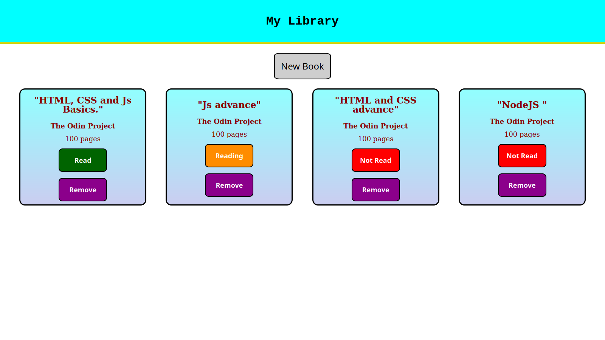

# My-Library

## This project is a practice about Objects and Object Constructors in JS.
### Project My-Library has:
* Add new book and display it.
* Change your Reading status on book.
* Remove a book.
* Save data to your local machine.
